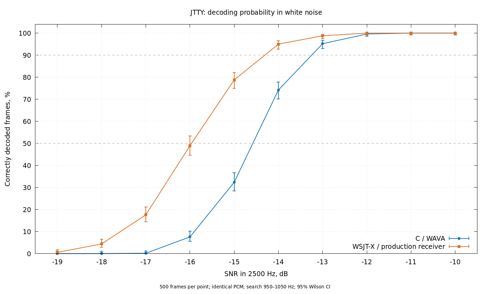

# JTTY C versus WSJT-X sensitivity comparison

Date: 2026-09-28. Both receivers, including time and frequency acquisition,
were tested on identical noisy PCM samples. The C library code was not changed
during the experiment.

**A practical operating point for the current C implementation is approximately
−13 dB SNR in a 2500 Hz bandwidth.** At that level, 476/500 frames were received
(95.2%; 95% confidence interval 93.0–96.8%). For almost error-free single-frame
reception under these conditions, the reference point is −12 dB: 498/500 (99.6%).

## Thresholds

| Probability of correct decoding | C | WSJT-X | WSJT-X advantage |
| --- | ---: | ---: | ---: |
| 50% | −14.6 dB | −16.0 dB | About 1.4 dB |
| 90% | −13.2 dB | −14.3 dB | About 1.1 dB |

Thresholds were linearly interpolated between adjacent measurements spaced
1 dB apart. Decimal places indicate an approximate estimate, not measurement
precision. Wilson confidence intervals were calculated separately for the
probability at each measured SNR; they are not confidence intervals for the
interpolated thresholds. Reusing the same messages and noise across SNR levels
makes the points on the curve correlated.

A "minimum SNR" is ambiguous without a probability criterion. The C receiver
occasionally decodes well below its operating threshold: 38/500 (7.6%) at
−16 dB, 1/500 (0.2%) at −17 dB, and 0/500 at both −18 and −19 dB. A rare success
at −17 dB does not make that level suitable for reliable communication.



[SVG](sensitivity.svg), [full table with confidence intervals](rates.md),
[raw results](paired.csv), [numerical thresholds](thresholds.json).

## Method

- Original WSJT-X generator: `tbcc_encode` + `gen_jttywave`, 4-GFSK, BT=2,
  12000 Hz, one 1.888-second frame. The C transmitter is not used in the main
  comparison.
- 500 trials per level from −10 to −19 dB. Half the payloads are random full
  SERIAL exchanges in 0–131071; half are random alphanumeric TEXT5 atoms.
  EOM is always set. Each SNR uses the same 500 scenarios, with initial RNG
  state `0x8c754ea1`.
- The lowest-tone frequency is uniformly distributed over 965–1035 Hz. The
  frame begins at a random sample in 120–5419, approximately 10–452 ms into
  the buffer. The true values are not supplied to the receivers.
- Each buffer contains 45312 samples (3.776 seconds). White Gaussian noise is
  present throughout, including before and after the signal.
- Both receivers search 950–1050 Hz. The current C harness uses `jtty_rx_process` followed by `jtty_rx_flush`.
  The original measurements below predate the streaming receiver.
  WSJT-X uses the original `rjtty_sub` → `jtty_mdecode_step` pipeline, including
  `jtty_mdecode`, correlators, the coherent list-decoder ladder, retries, and
  signal subtraction. This compares full receivers, not just FEC decoders
  with ideal synchronization.
- WSJT-X session state is reset before each independent buffer using the same
  procedure as the original `test_jtty_structured_decode.f90`. Parameters:
  `nsps=384`, `f0=1000`, `ftol=50`, `nfa=950`, `nfb=1050`, and the standard
  `smin=4.6`. Unmodified reference files and checksums are recorded in
  [sources.sha256](sources.sha256).
- Clean-frame RMS is normalized exactly to `sqrt(0.5)`. For real white noise
  at Fs=12000 Hz and SNR in 2500 Hz:
  `sigma² = 0.5 * (12000/2) / (2500 * 10^(SNR/10)) = 1.2 / 10^(SNR/10)`.
  Before quantization, a common scale of `1000/sigma` gives the noise an RMS
  of 1000 PCM16 units. Every sample is checked for clipping; none occurred.
  C receives the same PCM16 values converted to float by division by 32768.
  The receivers therefore have identical input noise, quantization, and gain.
- C success means returning the original 34-bit payload. WSJT-X success means
  returning the original text with EOM through its standard update interface.
  Each receiver performs its own CRC and grammar checks. A trial can count
  as successful only once; additional incorrect outputs are counted separately.
- Build: GCC/GFortran 9.4.0, `-O2`, FFTW3f, no OpenMP. Original files were not
  edited. Fortran and FFTW are dependencies of this comparison harness only,
  not of `libjtty`.

## Incorrect outputs

In 5000 signal trials, C returned no incorrect frames. WSJT-X produced 15 extra
incorrect text updates, including incomplete messages. These counting units
differ: C counts frames, while WSJT-X counts updates from its interface.
The number 15 should not be interpreted as the number of unique incorrect
radio frames without further analysis of WSJT-X internal state.

Extra outputs were not excluded from the statistics. A diagnostic repeat of
500 trials at −10 dB reproduced four such outputs while correctly receiving
all 500 messages: [diagnostic.log](diagnostic.log). This experiment does not
determine the cause of the false updates within WSJT-X.

A separate control used 1000 independent noise-only buffers, seed `0xf8098231`,
with the same duration, noise amplitude, and search range. Both receivers
returned **0** decodes: [noise.csv](noise.csv). An observed rate of zero does
not prove the absence of false detections outside this sample.

## Scope

Results apply to one isolated frame in stationary white noise and a narrow
100 Hz search window. Fading, multipath, neighboring stations, impulsive
interference, frequency drift, and sample-clock error were not simulated.
The probability of receiving an entire multi-frame message was not measured.
A wider search range may also change correct- and false-detection probabilities.

## Reproduction

From the `jtty` project root:

```sh
make sensitivity-build
./build/sensitivity/compare 500 -10 -19 0x8c754ea1 > tests/sensitivity/paired.csv
./build/sensitivity/compare 1000 0 0 0xf8098231 --noise > tests/sensitivity/noise.csv
python3 tests/sensitivity/report.py
gnuplot tests/sensitivity/plot.gp
```

These commands are combined in `./tests/sensitivity/run.sh`.
To select another source location or compiler:
`WSJTX_SOURCE=/path/to/wsjtx FC=gfortran make sensitivity-build`.
Requirements: GCC/Clang, GFortran, FFTW3f; report generation also needs Python 3
without additional packages and gnuplot with SVG/pngcairo terminals.
`pilot.csv` contains the preliminary run and is excluded from the main estimates.
The `*_seconds` columns measure CPU time, not real-time decoding latency.
